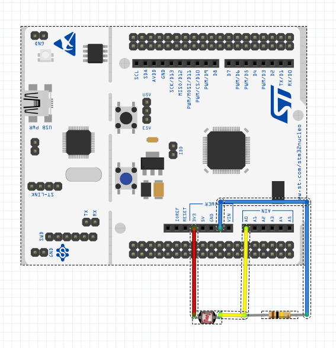

LiveObjects Iot Value Sample
==============================

This is a Live Objects IoT device example for mbed OS, running on STM32F429 NUCLEO-144.

The application:

1. Connects to network with Ethernet (using DHCP)
1. Connects to the [Datavenue Live Objects Plaftorm](https://liveobjects.orange-business.com/doc/html/lo_manual.html), using:
    * an optional secure connection (TLS)
    * the LiveObjects mode: [Json+Device](https://liveobjects.orange-business.com/doc/html/lo_manual.html#MQTT_MODE_DEVICE)
1. Publishs 
    * the [current Status/Info](https://liveobjects.orange-business.com/doc/html/lo_manual.html#MQTT_DEV_INFO). 
    * the [current data values](https://liveobjects.orange-business.com/doc/html/lo_manual.html#MQTT_DEV_DATA). 


## Required hardware

* [STM32F429](http://www.st.com/en/microcontrollers/stm32f429-439.html?querycriteria=productId=LN1806) board.
* 1 micro-USB cable.
* Ethernet cable and connection to the internet.
* Light sensor (1 resistor + 1 Photoresistor)

## Wiring hardware



## Required software

* [mbed-cli](https://github.com/ARMmbed/mbed-cli) - to build the sample programs.
To learn how to build mbed OS applications with mbed-cli, 
see [the user guide](https://github.com/ARMmbed/mbed-cli/blob/master/README.md).
    * [GCC ARM Embedded Toolchain](https://launchpad.net/gcc-arm-embedded/): Use [5-2015-q4-major](https://launchpad.net/gcc-arm-embedded/5.0/5-2015-q4-major)
    * [Python 2.7](https://www.python.org/downloads/): use [Python 2.7.12 2016-06-25](https://www.python.org/downloads/release/python-2712/)
* [Serial port monitor](https://developer.mbed.org/handbook/SerialPC#host-interface-and-terminal-applications).
* [LiveObjects account](http://liveobjects.orange-business.com)


## Brief install
```

# Install Python 2.7.12 (for example in C:\Python27)  
# Update your environment variable PATH to add "C:\Python27;C:\Python27\Scripts"  


# Install GCC ARM embeded tool chain  


# Install mbed-cli  
 git clone https://github.com/ARMmbed/mbed-cli 
 cd mbed-cli   
 python setup.py install  
 
 mbed config --global GCC_ARM_PATH "C:\Program Files (x86)\GNU Tools ARM Embedded\5.2 2015q4\bin"  

```

## Application setup

To configure the sample application, please:

1. [Setup Ethernet](#ethernet-settings).
1. [Get  the LiveObjects API key](#liveobjects-api-key).
1. [Create and update the user defintions](#liveobjects-header-file).

### Ethernet settings

The sample application only uses an Ethernet connection (with DHCP server).

So you need:

- An Ethernet cable.
- An Ethernet connection to the internet.


### LiveObjects API Key


Visit [IoT Soft Box powered by Datavenue](https://liveobjects.orange-business.com/v2/#/sdk)

1. You need to request the creation of a developper account.
1. Then, with your LiveObjects user identifier, login to the [Live Objects portal](https://liveobjects.orange-business.com/#/login).
1. Go in 'Configuration - API key' tab, and add a new API key.   
**Don't forget to copy this API key value** in a local and secure place during this operation. 


### LiveObjects header file

Copy the template header file **liveobjects_dev_params.h.txt** in the new header file **liveobjects_dev_params.h** if it does not exist.

Edit this header file to update some values, in particular the **LiveObjects API key**.

For security purpose, you will need to split the ApiKey in two parts.
The first part is the first sixteen char of the ApiKey and the second one is the last sixteen char of the ApiKey.
 An example is given below:

```c
/** Here, set your LiveObject Apikey. It is mandatory to run the application
 *
 * C_LOC_CLIENT_DEV_API_KEY_P1 must be the first sixteen char of the ApiKey
 * C_LOC_CLIENT_DEV_API_KEY_P1 must be the last sixteen char of the ApiKey
 *
 * If your APIKEY is 0123456789abcdeffedcba9876543210 then
 * it should look like this :
 *
 * #define C_LOC_CLIENT_DEV_API_KEY_P1			0x0123456789abcdef
 * #define C_LOC_CLIENT_DEV_API_KEY_P2			0xfedcba9876543210
 *
 * */

 #define C_LOC_CLIENT_DEV_API_KEY_P1			0x0123456789abcdef
 #define C_LOC_CLIENT_DEV_API_KEY_P2			0xfedcba9876543210
```


## Terminal Emulator

Visit [Serial port monitor](https://developer.mbed.org/handbook/SerialPC#host-interface-and-terminal-applications).

Serial Port settings:

* Rate: 9600 baud
* Data: 8 bits
* Parity : None
* Stop : 1 stop bit
* Flow Ctrl: None


## Building this sample

To build the sample application:

1. Clone this repository in a local directory. (Note that the name of this directory will the name of binary file)
1. Open a command line tool and navigate to the project’s directory.
1. Execute the `mbed config root .` command. (if it fails, try `mbed new .` command
1. Update all sources using the `mbed update` command. This command installs packages: mbed-os, MQTTPacket, iotsoftbox-mqtt, and jsmn) 
1. [Configure](#application-setup) the client application.
1. Build the application by selecting the hardware board and build the toolchain using the command `mbed compile -m NUCLEO_F429ZI -t GCC_ARM`. mbed-cli builds a binary file under the project’s `.build` directory.	
1. Plug the Ethernet cable into the board if you are using Ethernet mode.
1. Plug the micro-USB cable into the **OpenSDA** port. The board is listed as a mass-storage device.
1. Drag and drop the binary `.build/NUCLEO_F429ZI/GCC_ARM/<local_dir_name>.bin` to the board to flash the application.
1. The board is automatically programmed with the new binary. A flashing LED on it indicates that it is still working. When the LED stops blinking, the board is ready to work.
1. Start the terminal emulator on serial port : mbed Serial Port (COM..). See [Terminal emulator](#terminal-emulator).
1. Press the **RESET** button on the board to run the program.


## Serial Terminal

The serial port is used by embedded sample application:

* output: to print debug/trace messages.


### Live Objects Portal

Using your Live Objects user account, go to [Live Objects Portal](https://liveobjects.orange-business.com/#/login).


### Live Objects Swagger

Go in [Live Objects Swagger User Interface](https://liveobjects.orange-business.com/swagger-ui/index.html).


